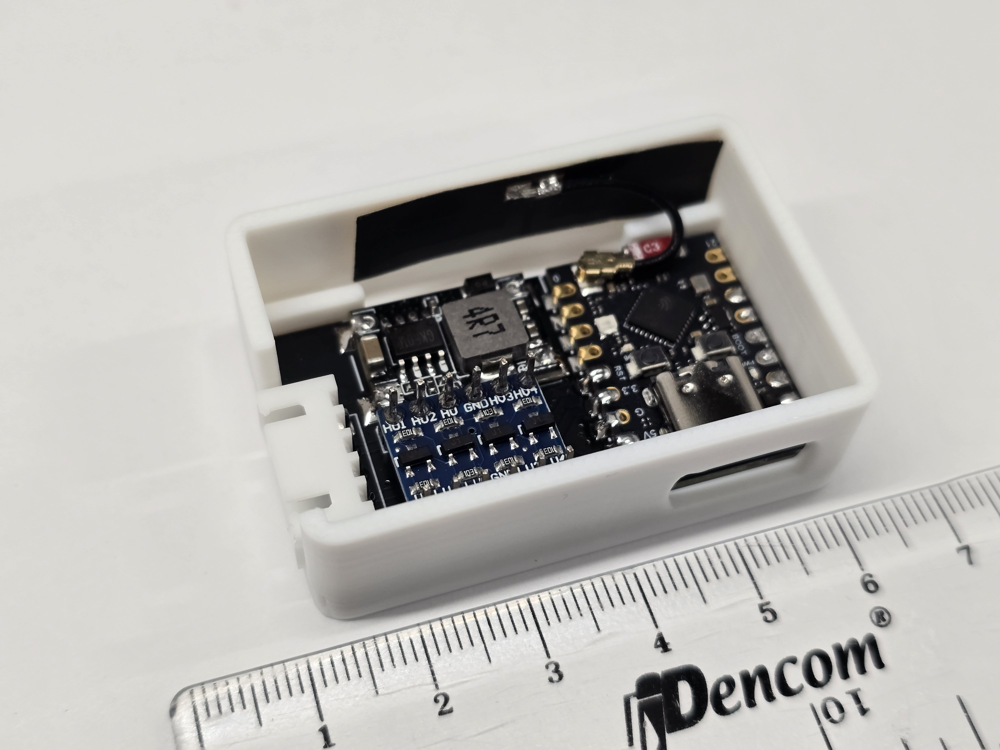

# 硬體設計 Hardware

## 電路圖 Schematic

### 設計說明:

1. GPIO10要與任一GPIO對接，此設計是接GPIO7
2. level shifter僅用3個，1個用不到
3. 連接至冷氣的此設計用90度彎針，也能直接用180度母頭，但焊接時需注意接頭方向，焊反插上去會燒，方向可參考下面冷氣底座

## 電路板 PCB

Size: 46.5mm x 26mm

## 成品圖

1. 焊接完成的板子: **要剃除模組上的天線，收訊才會好!!**

2. 放入3D列印殼中: **要剃除模組上的天線，收訊才會好!!**

3. 完成品，蓋上蓋與接上排線:

## 材料清單 Bill of Material

1. ESP32C3 super mini
2. 37*10mm FPC antenna 3cm long
3. DCDC 12V to 5V
4. 5V to 3.3V 4channel level shifter
5. XH2.54mm-5p 90degree male
6. XH2.54mm-5p female to female cable 50cm long

## 冷氣底座腳位定義 AC connector pin definition

